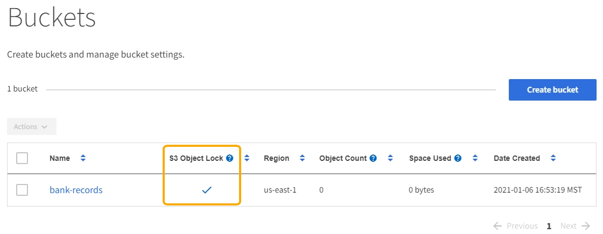

= 对租户使用 S3 对象锁定
:allow-uri-read: 
:icons: font
:imagesdir: ../media/

[role="lead"]
如果您的对象必须符合保留方面的法规要求，则可以使用 StorageGRID 中的 S3 对象锁定功能。

== 什么是 S3 对象锁定？

StorageGRID S3 对象锁定功能是一种对象保护解决方案 ，相当于 Amazon Simple Storage Service （ Amazon S3 ）中的 S3 对象锁定。

如图所示，如果为 StorageGRID 系统启用了全局 S3 对象锁定设置，则 S3 租户帐户可以在启用或不启用 S3 对象锁定的情况下创建存储分段。如果某个存储分段启用了 S3 对象锁定，则 S3 客户端应用程序可以选择为该存储分段中的任何对象版本指定保留设置。对象版本必须具有指定的保留设置，以受 S3 对象锁定的保护。

image::../media/s3_object_lock_architecture.png[S3 对象锁定架构]

StorageGRID S3 对象锁定功能提供了一种保留模式，相当于 Amazon S3 合规模式。默认情况下，任何用户都无法覆盖或删除受保护的对象版本。StorageGRID S3 对象锁定功能不支持监管模式，并且不允许具有特殊权限的用户绕过保留设置或删除受保护的对象。

如果存储分段启用了 S3 对象锁定，则在创建或更新对象时， S3 客户端应用程序可以选择指定以下任一或两个对象级别保留设置：

* * 保留至日期 * ：如果对象版本的保留至日期为未来日期，则可以检索该对象，但无法修改或删除它。可以根据需要增加对象的保留截止日期，但不能缩短此日期。
* * 合法保留 * ：对对象版本应用合法保留时，会立即锁定该对象。例如，您可能需要对与调查或法律争议相关的对象进行法律保留。合法保留没有到期日期，但在明确删除之前始终有效。合法保留与保留日期无关。

您也可以 xref:../s3/operations-on-buckets.adoc#using-s3-object-lock-default-bucket-retention[指定存储分段的默认保留模式和默认保留期限]。这些设置将应用于添加到存储分段中但不指定其自身保留设置的每个对象。

有关这些设置的详细信息，请参见 xref:../s3/using-s3-object-lock.adoc[使用 S3 对象锁定]。

== 管理旧版合规存储分段

S3 对象锁定功能取代了先前 StorageGRID 版本中提供的合规性功能。如果您使用早期版本的 StorageGRID 创建了合规的存储分段，则可以继续管理这些存储分段的设置；但是，您无法再创建新的合规存储分段。有关说明，请参见 NetApp 知识库文章。

https://kb.netapp.com/Advice_and_Troubleshooting/Hybrid_Cloud_Infrastructure/StorageGRID/How_to_manage_legacy_Compliant_buckets_in_StorageGRID_11.5["NetApp 知识库：如何在 StorageGRID 11.5 中管理原有的合规存储分段"^]

== S3 对象锁定工作流

工作流图显示了在 StorageGRID 中使用 S3 对象锁定功能的高级步骤。

在启用了 S3 对象锁定的情况下创建分段之前，网格管理员必须为整个 StorageGRID 系统启用全局 S3 对象锁定设置。网格管理员还必须确保 xref:../ilm/index.adoc[信息生命周期管理（ ILM ）策略] 符合 "`合规` " ；它必须满足启用了 S3 对象锁定的分段的要求。有关详细信息，请联系网格管理员或查看有关通过信息生命周期管理来管理对象的说明。

启用全局 S3 对象锁定设置后，您可以在启用了 S3 对象锁定的情况下创建存储分段。然后，您可以使用 S3 客户端应用程序为每个对象版本指定保留设置。

image::../media/s3_object_lock_workflow_tenant.png[S3 对象锁定工作流租户]

== S3 对象锁定的要求

在为存储分段启用 S3 对象锁定之前，请查看 S3 对象锁定存储分段和对象的要求以及启用了 S3 对象锁定的存储分段中对象的生命周期。

=== 启用了 S3 对象锁定的存储分段的要求

* 如果为 StorageGRID 系统启用了全局 S3 对象锁定设置，则可以使用租户管理器，租户管理 API 或 S3 REST API 创建启用了 S3 对象锁定的分段。
+
此租户管理器示例显示了一个已启用 S3 对象锁定的存储分段。

+

* 如果您计划使用 S3 对象锁定，则必须在创建存储分段时启用 S3 对象锁定。您不能为现有存储分段启用 S3 对象锁定。
* S3 对象锁定需要分段版本。为存储分段启用 S3 对象锁定后， StorageGRID 会自动为该存储分段启用版本控制。
* 在启用了 S3 对象锁定的情况下创建存储分段后，无法禁用 S3 对象锁定或暂停该存储分段的版本控制。
* 您也可以为存储分段配置默认保留。上传对象版本时，默认保留将应用于对象版本。您可以通过在上传对象版本的请求中指定保留模式和保留至日期来覆盖存储分段默认值。
* S3 对象生命周期分段支持分段生命周期配置。
* 启用了 S3 对象锁定的存储分段不支持 CloudMirror 复制。

=== 启用了 S3 对象锁定的分段中的对象的要求

* 要保护对象版本， S3 客户端应用程序必须配置存储分段默认保留，或者在每个上传请求中指定保留设置。
* 您可以增加对象版本的保留截止日期，但不能减小此值。
* 如果您收到有关待定法律诉讼或监管调查的通知，则可以通过对对象版本进行法律保留来保留相关信息。如果对象版本处于合法保留状态，则无法从 StorageGRID 中删除该对象，即使该对象已达到保留日期。一旦取消合法保留，如果已达到保留日期，则可以删除对象版本。
* S3 对象锁定需要使用版本控制的分段。保留设置适用于各个对象版本。对象版本可以同时具有保留截止日期和合法保留设置，但不能具有其他设置，或者两者均不具有。为对象指定保留日期或合法保留设置仅保护请求中指定的版本。您可以创建新版本的对象，而先前版本的对象仍保持锁定状态。

=== 启用了 S3 对象锁定的存储分段中的对象生命周期

保存在启用了 S3 对象锁定的存储分段中的每个对象将经历三个阶段：

. * 对象载入 *
+
** 在启用了 S3 对象锁定的情况下，将对象版本添加到存储分段时， S3 客户端应用程序可以选择为此对象指定保留设置（ retene-until date ， legal hold 或两者）。然后， StorageGRID 会为此对象生成元数据，其中包括唯一对象标识符（ UUID ）以及载入日期和时间。
** 载入具有保留设置的对象版本后，将无法修改其数据和 S3 用户定义的元数据。
** StorageGRID 存储的对象元数据与对象数据无关。它会为每个站点上的所有对象元数据维护三个副本。

. * 对象保留 *
+
** StorageGRID 会存储该对象的多个副本。副本的确切数量和类型以及存储位置取决于活动 ILM 策略中的合规规则。

. * 对象删除 *
+
** 达到保留截止日期后，可以删除对象。
** 无法删除处于合法保留状态的对象。

