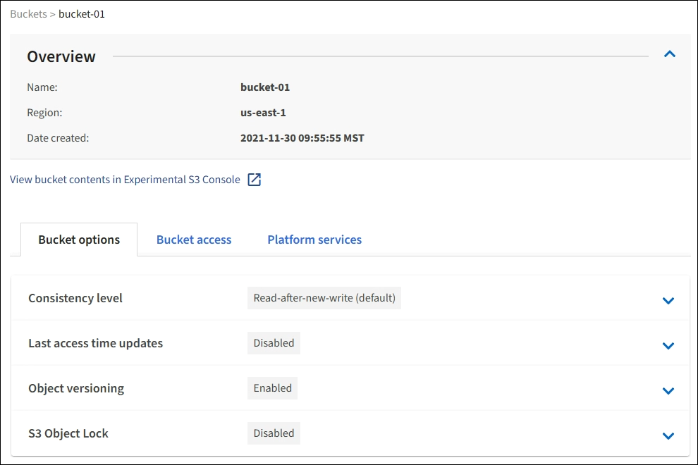

= 查看 S3 存储分段详细信息
:allow-uri-read: 
:icons: font
:imagesdir: ../media/

[role="lead"]
您可以查看租户帐户中的分段和分段设置列表。

.您需要的内容
* 您必须使用登录到租户管理器 xref:../admin/web-browser-requirements.adoc[支持的 Web 浏览器]。

.步骤
. 选择 * 存储（ S3 ） * > * 分段 * 。
+
此时将显示 " 分段 " 页面，其中列出了租户帐户的所有分段。

+
image::../media/buckets_table.png[存储分段表]

. 查看每个存储分段的信息。
+
您可以根据需要按任何列对信息进行排序，也可以在列表中向前和向后翻页。

+
** name ：存储分段的唯一名称，不能更改。
** S3 对象锁定：是否为此存储分段启用了 S3 对象锁定。
+
如果禁用全局 S3 对象锁定设置，则不会显示此列。此列还会显示任何旧版合规存储分段的信息。

** 区域：分段的区域，无法更改。
** Object Count ：此分段中的对象数。
** 已用空间：此分段中所有对象的逻辑大小。逻辑大小不包括复制的或经过纠删编码的副本或对象元数据所需的实际空间。
** Date created ：创建存储分段的日期和时间。

+

IMPORTANT: 显示的对象计数和已用空间值为估计值。这些估计值受载入时间，网络连接和节点状态的影响。如果分段启用了版本控制，则删除的对象版本将包含在对象计数中。

. 要查看和管理存储分段的设置，请选择存储分段名称。
+
您可以通过存储分段详细信息页面查看和编辑存储分段选项，存储分段访问和的设置 xref:what-platform-services-are.adoc[平台服务]。

+

