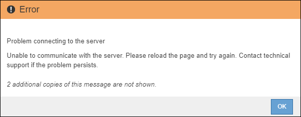

= 执行升级
:allow-uri-read: 
:icons: font
:imagesdir: ../media/

[role="lead"]
准备好执行升级后，请选择 ` .upgrade` archive 并输入配置密码短语。您可以选择在执行实际升级之前运行升级预检。

您已查看所有注意事项并完成所有规划和准备步骤。

== 上传升级文件

. 使用登录到网格管理器 xref:../admin/web-browser-requirements.adoc[支持的 Web 浏览器]。
. 选择 * 维护 * > * 系统 * > * 软件更新 * 。
+
此时将显示软件更新页面。

. 选择 * StorageGRID Upgrade* 。
. 在 StorageGRID 升级页面上，选择 ` .upgrade` archive 。
+
.. 选择 * 浏览 * 。
.. 找到并选择文件： `NetApp_StorageGRID_11.6.0_Software_uniqueID.upgrade`
.. 选择 * 打开 * 。
+
已上传并验证此文件。验证过程完成后，升级文件名称旁边会显示一个绿色复选标记。

. 在文本框中输入配置密码短语。
+
已启用 * 运行预检 * 和 * 开始升级 * 按钮。

+
image::../media/storagegrid_upgrade_buttons_enabled.png[已启用 StorageGRID 升级按钮]

== 运行预检

您也可以在开始实际升级之前验证系统的状况。选择 * 运行预检 * 可在开始升级之前检测并解决问题。开始升级时，系统会执行相同的预检。预检失败将停止升级过程，某些问题可能需要技术支持参与才能解决。

. 选择 * 运行预检 * 。
. 等待预检完成。
. 按照说明解决报告的任何预检错误。
+

IMPORTANT: 如果您已打开任何自定义防火墙端口，则会在预检验证期间收到通知。在继续升级之前，您必须联系技术支持。

== 开始升级并更新主管理节点

升级开始时，系统会执行升级预检，并升级主管理节点，其中包括停止服务，升级软件和重新启动服务。在升级主管理节点时，您无法访问网格管理器。审核日志也将不可用。此升级可能需要长达 30 分钟的时间。

. 准备好执行升级后，请选择 * 开始升级 * 。
+
此时将显示一条警告，提醒您在重新启动主管理节点后，浏览器的连接将断开。

+
image::../media/software_upgrade_connection_will_be_lost.png[软件升级连接将丢失]

. 选择 * 确定 * 确认警告并启动升级过程。
. 等待执行升级预检并升级主管理节点。
+

NOTE: 如果报告了任何预检错误，请解决这些错误，然后再次选择 * 开始升级 * 。

+
在升级主管理节点时，会显示多条 * 503 ： service unavail* 和 * 连接到服务器时出现问题 * 消息，您可以忽略这些消息。

+
image::../media/software_upgrade_503_error.png[软件升级 503 错误]

+

. 当您看到 * 400 ： bad request* 消息时，请转至下一步。管理节点升级已完成。
+
image::../media/software_upgrade_400_error.png[软件升级 400 错误]

== 清除浏览器缓存并重新登录

. 升级主管理节点后，清除 Web 浏览器的缓存并重新登录。
+
有关说明，请参见 Web 浏览器的文档。

+

IMPORTANT: 您必须清除 Web 浏览器的缓存，才能删除先前版本的软件所使用的过时资源。

+
此时将显示经过重新设计的 Grid Manager 界面，表示主管理节点已升级。

+
image::../media/grid_manager_dashboard.png[网格管理器信息板]

. 从边栏中，选择 * 维护 * 以打开维护菜单。
. 在 * 系统 * 部分中，选择 * 软件更新 * 。
. 在 * StorageGRID Upgrade* 部分中，选择 * 升级 * 。
. 查看 StorageGRID 升级页面上的升级进度部分，其中提供了有关每个主要升级任务的信息。
+
.. * 启动升级服务 * 是第一个升级任务。在此任务期间，软件文件将分发到网格节点，并启动升级服务。
.. 完成 * 启动升级服务 * 任务后， * 升级网格节点 * 任务将启动。
.. 在执行 * 升级网格节点 * 任务期间，将显示网格节点状态表，其中显示了系统中每个网格节点的升级阶段。

== 下载恢复软件包并升级所有网格节点

. 在网格节点状态表中显示网格节点之后，但在批准任何网格节点之前， xref:obtaining-required-materials-for-software-upgrade.adoc#download-the-recovery-package[下载恢复软件包的新副本]。
+

IMPORTANT: 升级主管理节点上的软件版本后，必须下载恢复软件包文件的新副本。通过恢复包文件，您可以在发生故障时还原系统。

. 查看网格节点状态表中的信息。网格节点按管理节点， API 网关节点，存储节点和归档节点等类型按部分进行排列。
+
image::../media/software_upgrade_start_grid_node_status.png[管理节点完成后升级网格节点的屏幕截图]

+
首次显示此页面时，网格节点可能处于以下阶段之一：

+
** Done （完成）（仅限主管理节点）
** 正在准备升级
** 软件下载已排队
** 正在下载
** 正在等待您批准

. 批准已准备好添加到升级队列的网格节点。
+

IMPORTANT: 在网格节点上开始升级时，该节点上的服务将停止。稍后，网格节点将重新启动。为避免与节点通信的客户端应用程序出现服务中断，请勿批准节点升级，除非您确定节点已做好停止和重新启动的准备。根据需要计划维护时段或通知客户。

+
您必须升级 StorageGRID 系统中的所有网格节点，但可以自定义升级顺序。您可以批准单个网格节点，一组网格节点或所有网格节点。

+
如果节点升级顺序非常重要，请逐个批准节点或节点组，并等待每个节点完成升级，然后再批准下一个节点或节点组。

+
** 选择一个或多个 * 批准 * 按钮将一个或多个单独的节点添加到升级队列。如果您批准多个相同类型的节点，则这些节点将一次升级一个。
** 在每个部分中选择 * 全部批准 * 按钮，将所有相同类型的节点添加到升级队列。
** 选择顶级 * 全部批准 * 按钮，将网格中的所有节点添加到升级队列。
** 选择 * 删除 * 或 * 全部删除 * 可从升级队列中删除一个或所有节点。当节点的阶段达到 * 正在停止服务 * 时，您无法删除该节点。此时将隐藏 * 删除 * 按钮。
+
image::../media/software_upgrade_two_nodes_queued.png[显示 Stage 正在停止服务的屏幕截图]

. 等待每个节点继续完成升级阶段，包括已排队，停止服务，停止容器，清理 Docker 映像，升级基础操作系统软件包，重新启动，重新启动后执行步骤，启动服务以及完成。
+

NOTE: 当设备节点达到升级基本操作系统软件包阶段时，设备上的 StorageGRID 设备安装程序软件将会更新。此自动化过程可确保 StorageGRID 设备安装程序版本与 StorageGRID 软件版本保持同步。

== 完成升级

当所有网格节点都完成升级阶段后， * 升级网格节点 * 任务将显示为已完成。其余升级任务将在后台自动执行。

. 完成 * 启用功能 * 任务后（该任务会很快发生），您可以选择开始使用升级后的 StorageGRID 版本中的新功能。
. 在执行 * 升级数据库 * 任务期间，升级过程会检查每个节点，以确认不需要更新 Cassandra 数据库。
+

NOTE: 从 StorageGRID 11.5 升级到 11.5 不需要升级 Cassandra 数据库；但是， Cassandra 服务将在每个存储节点上停止并重新启动。对于未来的 StorageGRID 功能版本， Cassandra 数据库更新步骤可能需要几天时间才能完成。

. 完成 * 升级数据库 * 任务后，请等待几分钟，以完成 * 最终升级步骤 * 任务。
+
完成最终升级步骤任务后，将完成升级。

== 确认升级

. 确认升级已成功完成。
+
.. 从网格管理器顶部，选择帮助图标并选择 * 关于 * 。
.. 确认显示的版本符合您的预期。
.. 选择 * 维护 * > * 系统 * > * 软件更新 * 。
.. 在 * StorageGRID upgrade* 部分中，选择 * 升级 * 。
.. 确认绿色横幅显示软件升级已在预期日期和时间完成。
+
image::../media/software_upgrade_done.png[软件升级已完成]

. 在 StorageGRID 升级页面中，确定当前 StorageGRID 版本是否有任何修补程序可用。
+

NOTE: 如果未显示更新路径，则您的浏览器可能无法访问 NetApp 支持站点。或者， AutoSupport 页面（ * 支持 * > * 工具 * > * AutoSupport * ）上的 * 检查软件更新 * 复选框可能已禁用。

. 如果有可用的修补程序，请下载此文件。然后，使用 xref:../maintain/storagegrid-hotfix-procedure.adoc[StorageGRID 热修补程序操作步骤] 以应用此修补程序。
. 验证网格操作是否已恢复正常：
+
.. 检查这些服务是否正常运行，以及是否没有意外警报。
.. 确认客户端与 StorageGRID 系统的连接是否按预期运行。

