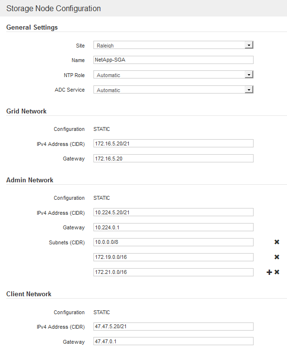
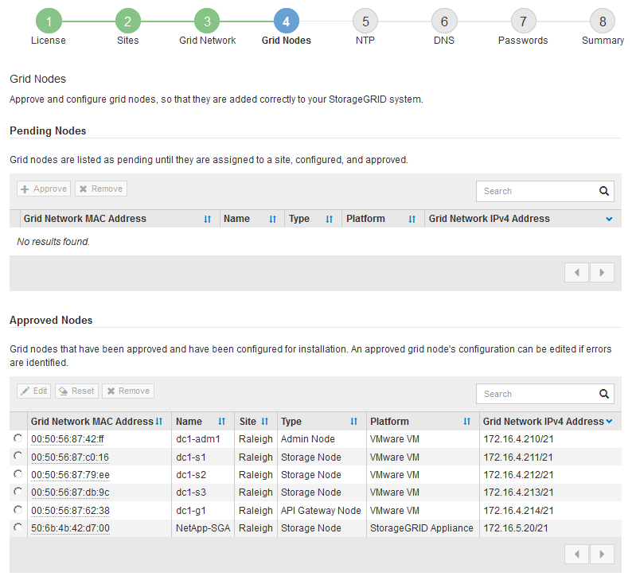

= 批准待定网格节点
:allow-uri-read: 
:icons: font
:imagesdir: ../media/

[role="lead"]
您必须先批准每个网格节点，然后才能将其加入 StorageGRID 系统。

.您需要的内容
您已部署所有虚拟设备和 StorageGRID 设备网格节点。

IMPORTANT: 对所有节点执行一次安装比现在安装某些节点以及稍后安装某些节点更高效。

.步骤
. 查看 Pending Nodes 列表，并确认它显示了您部署的所有网格节点。
+

NOTE: 如果缺少网格节点，请确认已成功部署该节点。

. 选择要批准的待定节点旁边的单选按钮。
+
image::../media/5_gmi_installer_grid_nodes_pending.gif[此图通过周围的文本进行了说明。]

. 单击 * 批准 * 。
. 在常规设置中，根据需要修改以下属性的设置：
+

+
** * 站点 * ：要与此网格节点关联的站点的名称。
** * 名称 * ：分配给节点的名称以及将在网格管理器中显示的名称。此名称默认为您在配置节点时指定的名称。在安装过程的此步骤中，您可以根据需要更改名称。
+

IMPORTANT: 完成安装后，您将无法更改节点的名称。

+

NOTE: 对于 VMware 节点，您可以在此处更改名称，但此操作不会更改 vSphere 中虚拟机的名称。

** * NTP 角色 * ：网格节点的网络时间协议（ NTP ）角色。选项包括 * 自动 * ， * 主 * 和 * 客户端 * 。选择 * 自动 * 会将主角色分配给管理节点，具有模板转换服务的存储节点，网关节点以及具有非静态 IP 地址的任何网格节点。所有其他网格节点都分配有客户端角色。
+

IMPORTANT: 确保每个站点至少有两个节点可以访问至少四个外部 NTP 源。如果一个站点上只有一个节点可以访问 NTP 源，则在该节点关闭时会发生计时问题。此外，指定每个站点两个节点作为主要 NTP 源可确保在站点与网格其余部分隔离时的时间准确无误。

** * ADC* 服务 * （仅限存储节点）：选择 * 自动 * ，让系统确定节点是否需要管理域控制器（ ADC* ）服务。此 ADA 服务可跟踪网格服务的位置和可用性。每个站点至少有三个存储节点必须包含此 ADC-Service 。在部署此节点后，您不能将此 ADC 服务添加到该节点中。

. 在网格网络中，根据需要修改以下属性的设置：
+
** * IPv4 地址（ CIDR ） * ：网格网络接口（容器中的 eth0 ）的 CIDR 网络地址。例如： 192.168.1.234/21
** * 网关 * ：网格网络网关。例如： 192.168.0.1
+

NOTE: 如果存在多个网格子网，则需要使用网关。

+

NOTE: 如果您为网格网络配置选择了 DHCP 并在此更改了值，则新值将配置为节点上的静态地址。您必须确保生成的 IP 地址不在 DHCP 地址池中。

. 如果要为网格节点配置管理网络，请根据需要在管理网络部分中添加或更新设置。
+
在 * 子网（ CIDR ） * 文本框中输入从此接口路由的目标子网。如果存在多个管理子网，则需要使用管理网关。

+

NOTE: 如果您为管理网络配置选择了 DHCP 并在此更改了值，则新值将配置为节点上的静态地址。您必须确保生成的 IP 地址不在 DHCP 地址池中。

+
* 设备： * 对于 StorageGRID 设备，如果在初始安装期间未使用 StorageGRID 设备安装程序配置管理网络，则无法在此网格管理器对话框中进行配置。而是必须执行以下步骤：

+
.. 重新启动设备：在设备安装程序中，选择 * 高级 * > * 重新启动 * 。
+
重新启动可能需要几分钟时间。

.. 选择 * 配置网络 * > * 链路配置 * 并启用相应的网络。
.. 选择 * 配置网络 * > * IP 配置 * 并配置已启用的网络。
.. 返回主页页面，然后单击 * 开始安装 * 。
.. 在网格管理器中：如果节点列在 "Approved Nodes" 表中，请重置节点。
.. 从 Pending Nodes 表中删除此节点。
.. 等待节点重新出现在 "Pending Nodes" 列表中。
.. 确认您可以配置适当的网络。它们应已填充您在 IP 配置页面上提供的信息。
+
对于追加信息 ，请参见适用于您的设备型号的安装和维护说明。

. 如果要为网格节点配置客户端网络，请根据需要在客户端网络部分中添加或更新设置。如果配置了客户端网络，则需要使用网关，安装后，它将成为节点的默认网关。
+

NOTE: 如果您为客户端网络配置选择了 DHCP 并在此更改了值，则新值将配置为节点上的静态地址。您必须确保生成的 IP 地址不在 DHCP 地址池中。

+
* 设备： * 对于 StorageGRID 设备，如果在初始安装期间未使用 StorageGRID 设备安装程序配置客户端网络，则无法在此网格管理器对话框中进行配置。而是必须执行以下步骤：

+
.. 重新启动设备：在设备安装程序中，选择 * 高级 * > * 重新启动 * 。
+
重新启动可能需要几分钟时间。

.. 选择 * 配置网络 * > * 链路配置 * 并启用相应的网络。
.. 选择 * 配置网络 * > * IP 配置 * 并配置已启用的网络。
.. 返回主页页面，然后单击 * 开始安装 * 。
.. 在网格管理器中：如果节点列在 "Approved Nodes" 表中，请重置节点。
.. 从 Pending Nodes 表中删除此节点。
.. 等待节点重新出现在 "Pending Nodes" 列表中。
.. 确认您可以配置适当的网络。它们应已填充您在 IP 配置页面上提供的信息。
+
对于追加信息 ，请参见适用于您的设备的安装和维护说明。

. 单击 * 保存 * 。
+
网格节点条目将移至 "Approved Nodes" 列表。

+

. 对要批准的每个待定网格节点重复上述步骤。
+
您必须批准网格中所需的所有节点。但是，在单击 " 摘要 " 页面上的 * 安装 * 之前，您可以随时返回此页面。您可以通过选择已批准的网格节点的单选按钮并单击 * 编辑 * 来修改其属性。

. 批准完网格节点后，单击 * 下一步 * 。

