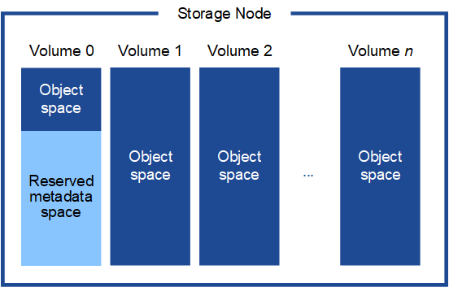

= 存储和性能要求
:icons: font
:imagesdir: ../media/

[role="lead"]
您必须了解虚拟机托管的 StorageGRID 节点的存储和性能要求，以便提供足够的空间来支持初始配置和未来的存储扩展。

== 性能要求

操作系统卷和第一个存储卷的性能会显著影响系统的整体性能。请确保在延迟，每秒输入 / 输出操作数（ IOPS ）和吞吐量方面提供足够的磁盘性能。

所有 StorageGRID 节点都要求操作系统驱动器和所有存储卷启用回写缓存。缓存必须位于受保护或永久性介质上。

== 使用 NetApp AFF 存储的虚拟机的要求

如果您要将 StorageGRID 节点部署为虚拟机，并从 NetApp AFF 系统分配存储，则表示您已确认卷未启用 FabricPool 分层策略。例如，如果 StorageGRID 节点在 VMware 主机上作为虚拟机运行，请确保为该节点的数据存储库提供支持的卷未启用 FabricPool 分层策略。对 StorageGRID 节点使用的卷禁用 FabricPool 分层可简化故障排除和存储操作。

IMPORTANT: 切勿使用 FabricPool 将与 StorageGRID 相关的任何数据分层回 StorageGRID 本身。将 StorageGRID 数据分层回 StorageGRID 会增加故障排除和操作复杂性。

== 所需的虚拟机数量

每个 StorageGRID 站点至少需要三个存储节点。

IMPORTANT: 在生产部署中，请勿在一个虚拟机服务器上运行多个存储节点。对每个存储节点使用专用虚拟机主机可提供一个隔离的故障域。

其他类型的节点（例如管理节点或网关节点）可以部署在同一虚拟机主机上，也可以根据需要部署在自己的专用虚拟机主机上。但是，如果您有多个相同类型的节点（例如两个网关节点），请勿将所有实例安装在同一虚拟机主机上。

== 按节点类型划分的存储要求

在生产环境中， StorageGRID 网格节点的虚拟机必须满足不同的要求，具体取决于节点类型。

NOTE: 磁盘快照不能用于还原网格节点。请参阅每种类型节点的恢复和维护过程。

[cols="1a,2a"]
|===
| 节点类型 | 存储 

 a| 
管理节点
 a| 
100 GB LUN ，用于操作系统

200 GB LUN ，用于管理节点表

200 GB LUN ，用于管理节点审核日志

 a| 
存储节点
 a| 
100 GB LUN ，用于操作系统

此主机上每个存储节点 3 个 LUN

* 注 * ：一个存储节点可以包含 1 到 16 个存储 LUN ；建议至少使用 3 个存储 LUN 。

每个 LUN 的最小大小： 4 TB

测试的最大 LUN 大小： 39 TB 。

 a| 
网关节点
 a| 
100 GB LUN ，用于操作系统

 a| 
归档节点
 a| 
100 GB LUN ，用于操作系统

|===

IMPORTANT: 根据配置的审核级别， S3 对象密钥名称等用户输入的大小以及需要保留的审核日志数据量，您可能需要增加每个管理节点上的审核日志 LUN 的大小。一般来说，网格在每个 S3 操作中生成大约 1 KB 的审核数据，这意味着 200 GB 的 LUN 每天支持 7 ， 000 万次操作，或者每秒 800 次操作，持续 2 到 3 天。

== 存储节点的存储要求

一个基于软件的存储节点可以包含 1 到 16 个存储卷—建议使用 3 个或更多存储卷。每个存储卷应大于或等于 4 TB 。

NOTE: 一个设备存储节点最多可以包含 48 个存储卷。

如图所示， StorageGRID 会为每个存储节点的存储卷 0 上的对象元数据预留空间。存储卷 0 和存储节点中的任何其他存储卷上的任何剩余空间专用于对象数据。

为了提供冗余并防止对象元数据丢失， StorageGRID 会为每个站点的系统中的所有对象存储三个元数据副本。对象元数据的三个副本均匀分布在每个站点的所有存储节点上。

在为新存储节点的卷 0 分配空间时，必须确保为该节点在所有对象元数据中的部分分配足够的空间。

* 您必须至少为卷 0 分配 4 TB 。
+

NOTE: 如果一个存储节点仅使用一个存储卷，而为该卷分配的存储空间不超过 4 TB ，则该存储节点可能会在启动时进入存储只读状态，并仅存储对象元数据。

* 如果要安装新的 StorageGRID 11.6 系统，并且每个存储节点的 RAM 为 128 GB 或更大，则应为卷 0 分配 8 TB 或更多。如果对卷 0 使用较大的值，则可以增加每个存储节点上允许的元数据空间。
* 在为站点配置不同的存储节点时，如果可能，请对卷 0 使用相同的设置。如果某个站点包含不同大小的存储节点，卷 0 最小的存储节点将确定该站点的元数据容量。

有关详细信息，请转至 xref:../admin/managing-object-metadata-storage.adoc[管理对象元数据存储]。

xref:../maintain/index.adoc[恢复和维护]
